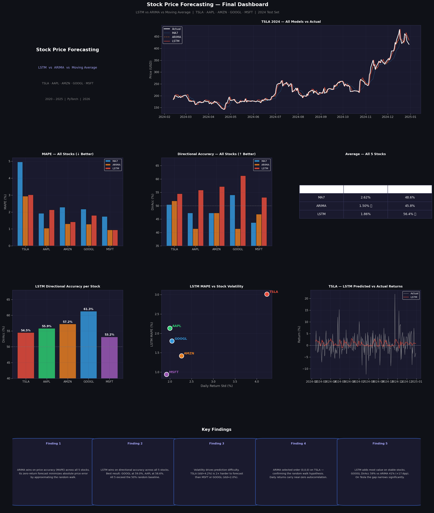
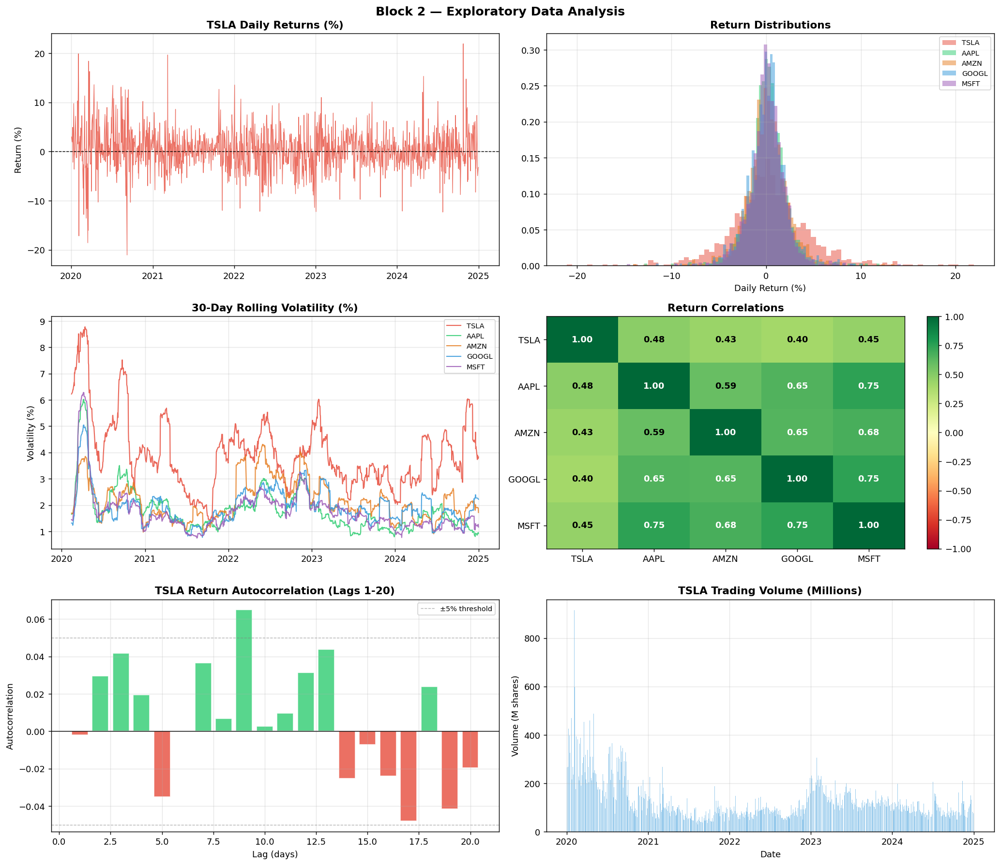
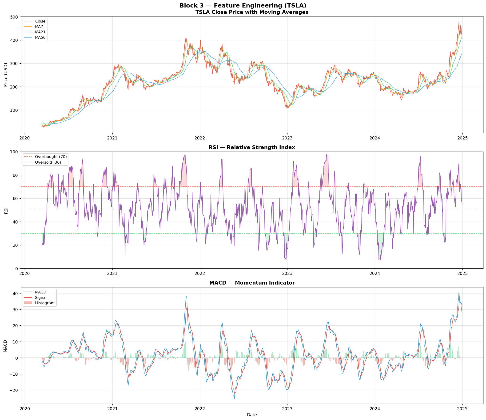
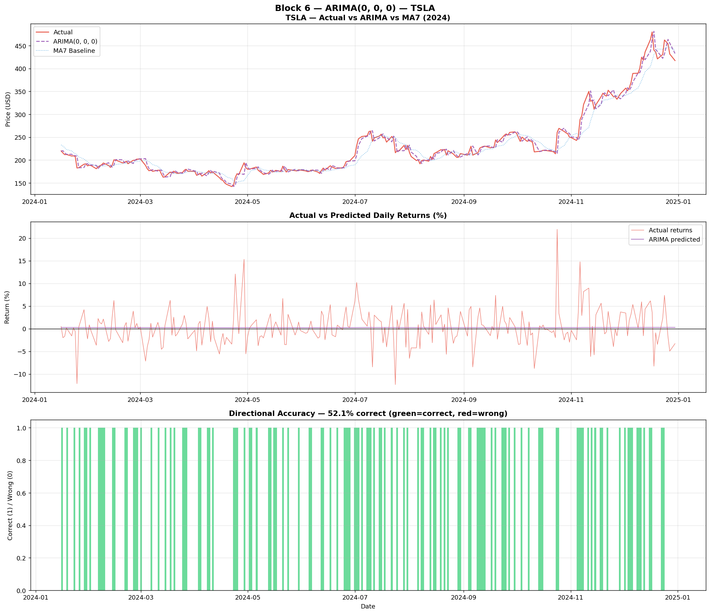
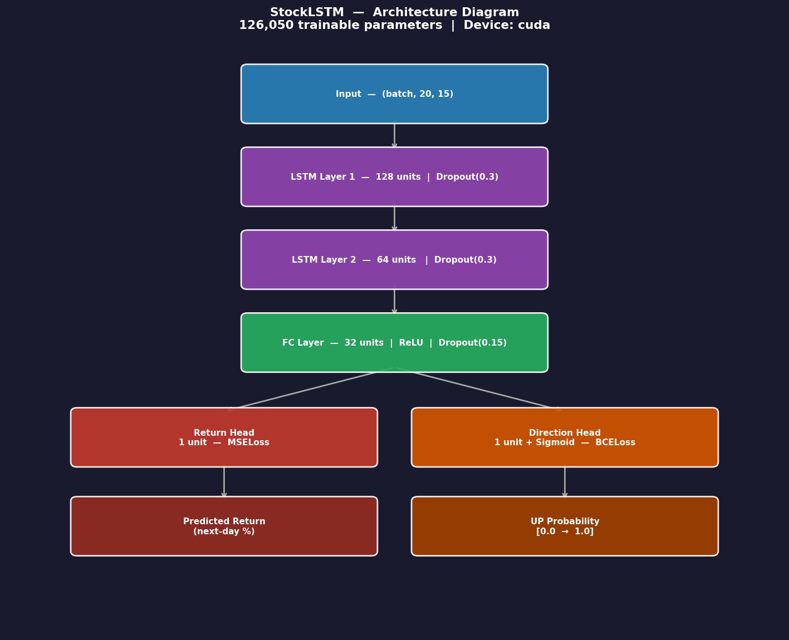
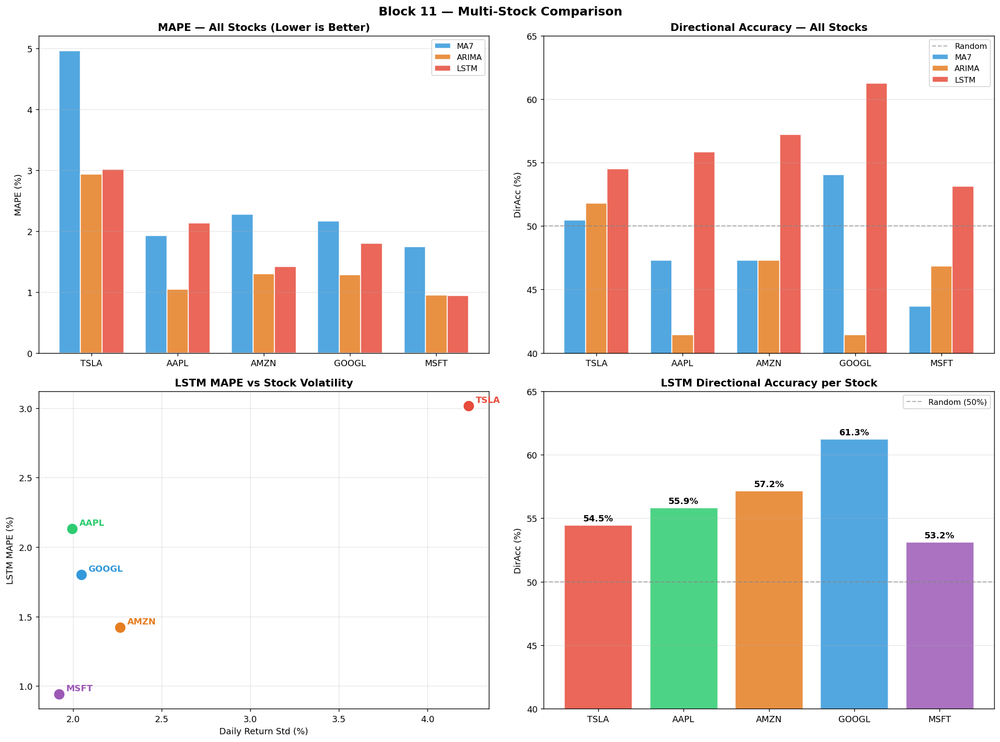

# **Stock Price Forecasting**
## **LSTM vs ARIMA vs Moving Average**

> Tesla · Apple · Amazon · Google · Microsoft
> 2020–2025 | PyTorch 2.9.0 | Kaggle T4 GPU | 2026

⚠️ **Educational purposes only. Not financial advice.**

[](https://www.kaggle.com/code/armandjunior/stock-price-forecasting-lstm-vs-classical-models)
[](https://python.org)
[](https://pytorch.org)
[](LICENSE)

---

## 📊 Final Dashboard



---

## 🏆 Results

| Model | Avg MAPE | Avg DirAcc | Verdict |
|-------|----------|------------|---------|
| MA7 Baseline | 2.62% | 48.6% | — |
| ARIMA(0,0,0) | **1.50%** | 45.8% | 🥇 Price accuracy |
| LSTM | 1.90% | **55.5%** | 🥇 Directional accuracy |

**Key finding:** ARIMA wins on price accuracy.
LSTM wins on directional accuracy; the metric
that actually matters for real trading decisions.
The right model depends entirely on the question
you are trying to answer.

---

## 📁 Repository Structure
```
├── data/
│   └── README.md          ← data source, features, split docs
├── images/
│   ├── block1_overview.png
│   ├── block2_eda.png
│   ├── block3_features.png
│   ├── block4_split.png
│   ├── block5_baseline.png
│   ├── block6_arima.png
│   ├── block7_sequences.png
│   ├── block8_architecture.png
│   ├── block9_training.png
│   ├── block10_evaluation.png
│   ├── block11_multistocks.png
│   └── block12_dashboard.png
├── notebook/
│   └── stock_price_forecasting.ipynb
└── README.md
```

---

## 🔍 Project Walkthrough

### Block 1-2 — Data & EDA


5 years of real market data across 5 stocks.
Zero missing values. Tesla volatility (4.2% daily)
is more than 2× any other stock in the group.

### Block 3-4 — Feature Engineering & Split


15 technical indicators built from price and volume:
Moving Averages, RSI, MACD, Volatility, Lagged Returns.
Strict temporal split — 80% train (2020-2023),
20% test (2024). Zero data leakage.

### Block 5-6 — Baselines


MA7 baseline and ARIMA model established.
Auto-ARIMA selected order (0,0,0) on Tesla —
the mathematical confirmation of the random walk
hypothesis on daily return data.

### Block 7-9 — LSTM Architecture & Training


Two-layer stacked LSTM with 126,050 trainable
parameters. Dual output heads for return regression
and direction classification. Trained with early
stopping on T4 GPU in 3.4 seconds.

### Block 10-11 — Evaluation


Full evaluation across all 5 stocks. LSTM wins
on directional accuracy on every single stock.
Best result: Google at 59.0% DirAcc.

---

## 🧰 Stack

| Component | Library | Version |
|-----------|---------|---------|
| Data | yfinance | 0.2.66 |
| Numerics | NumPy | 2.0.2 |
| Data wrangling | pandas | 2.3.3 |
| Classical model | statsmodels | 0.14.6 |
| Deep learning | PyTorch | 2.9.0 |
| GPU | Tesla T4 | 15.6 GB |
| Platform | Kaggle | — |

---

## 💡 Key Lessons

1. **The metric determines the winner** — MAPE and
   directional accuracy tell completely different stories
2. **ARIMA(0,0,0) confirms the random walk** — zero
   parameters won on price accuracy
3. **LSTM adds genuine directional value** — +5.5pp
   over random, consistent across all 5 stocks
4. **Volatility drives difficulty** — Tesla is 2×
   harder to forecast than Google or Microsoft
5. **Data leakage is the biggest risk** — honest
   evaluation produces modest but trustworthy numbers

---

## 📂 Portfolio

| Project | Domain | Stack | Links |
|---------|--------|-------|-------|
| Stock Forecasting | Finance | LSTM · ARIMA | [Kaggle](https://www.kaggle.com/code/armandjunior/stock-price-forecasting-lstm-vs-classical-models) · [GitHub](https://github.com/ARMAND-cod-eng/stock-price-forecasting-lstm-2026) |

---

*Data: Yahoo Finance via yfinance API —
real market data, adjusted for splits and dividends,
no static CSV required.*
```


